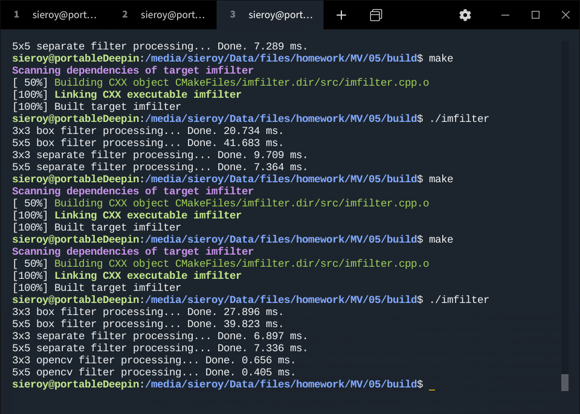

# 机器视觉 - 第五次作业

## 程序

```c++
说明：为防止抄袭，经征求作者本人同意，其中源代码已删除，仅保留运行效果。
```

## 输出截图

（当时后台有其他程序，耗时不太稳）



## 输出图像

| 原图(1000x600) | 原图灰度图(1000x600) |
| -------------- |----|
|  |  |

| 3x3盒型滤波(998x598)    | 5x5盒型滤波(996x596)    |
| ----------------------- | ----------------------- |
|  |  |

| 3x3分离滤波(998x598)         | 5x5分离滤波(996x596)         |
| ---------------------------- | ---------------------------- |
|  |  |

| 3x3 OpenCV库函数(1000x600) | 5x5 OpenCV库函数(1000x600) |
| -------------------------- | -------------------------- |
|  |  |

## 分析

- 速度上，使用定义法实现的均值滤波，大大逊色于分离滤波。
- 输出结果上，两种方法没什么区别。
- 而OpenCV的库函数就很厉害了，不仅在速度上大大优于定义法和分离法，而且输出的结果也不会由于滤波而出现边缘缩减的问题。


