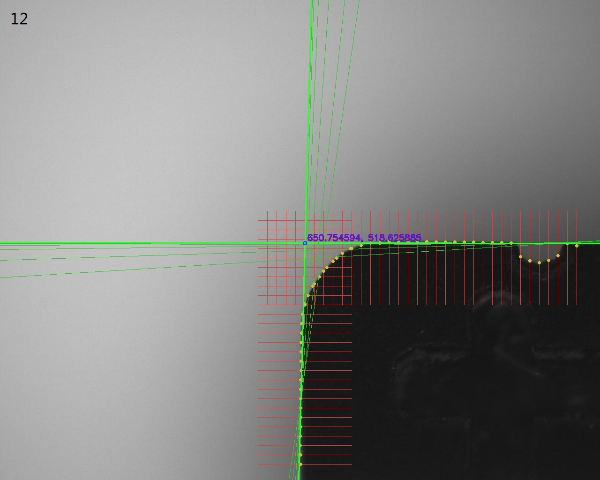

# 机器视觉-第八次作业

## 实现思路

- 观察目标图片们，为两个主要直线区域设置ROI。并观察主要直线，根据它们的倾角设置采样方向。
- 在每条采样线上间隔做差，以近似一阶导数，选其中大于阈值且最大的差值对应的点作为目标边缘像素。
- 对边缘像素进行最小二乘拟合，并根据拟合结果算出各点到直线的距离，利用这个距离来计算出$\varepsilon^2$、并计算点的权重。
- 根据权重，重新拟合，并计算出$\varepsilon^2$、更新权重，若此次计算出的$\varepsilon^2$与上一次$\varepsilon^2$的差值过大，可以认为没有收敛，重复该步。
- 对两条直线拟合完后，计算它们的交点，并绘制出来，输出图片结果。对每个图片，重复。

## 代码

```cpp
说明：为防止抄袭，经征求作者本人同意，其中源代码已删除，仅保留解题思路。
```

## 结果图





（可以减小阈值，以增加迭代次数，使结果更好一些。但已经可以明显看出较好的拟合效果了。）