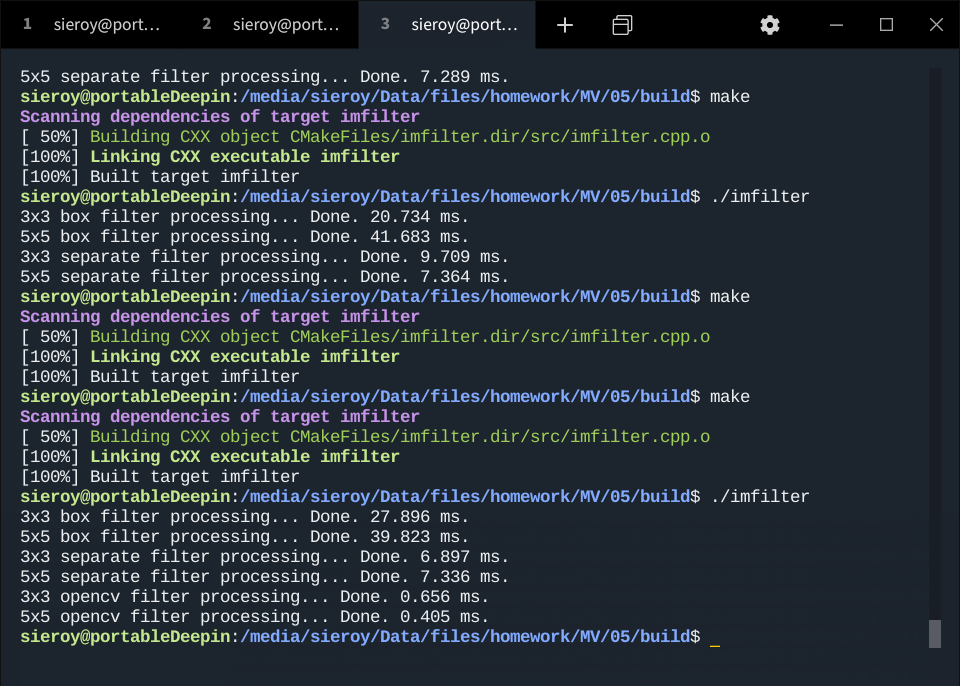
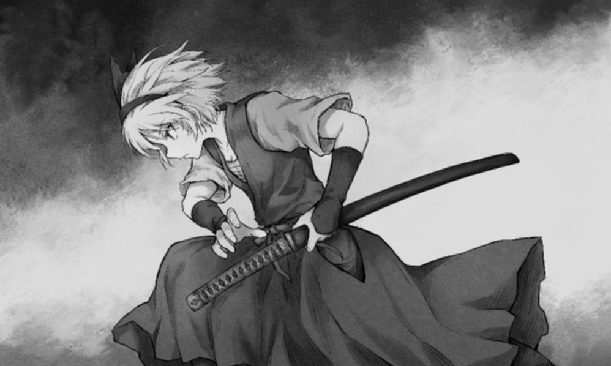

# 机器视觉 - 第五次作业

## 程序

```c++
#include "opencv2/opencv.hpp"
#include <time.h>
#include <iostream>

using namespace cv;
using namespace std;

void uniformFilterBox(Mat& in, Mat& out, int ksize);
void uniformFilterSeparate(Mat& in, Mat& out, int ksize);

int main(){
    Mat inImg, grayImg, filteredBoxImg, filteredSeparateImg, filterCVImg;
    clock_t clockval, clockdiv;

    inImg = imread("../input.png");
    cvtColor(inImg, grayImg, COLOR_RGB2GRAY);

    cout << "3x3 box filter processing...";
    clockval = clock();
    uniformFilterBox(grayImg, filteredBoxImg, 3);
    clockdiv = clock() - clockval;
    cout << " Done. " << clockdiv/1e3 << " ms.\n";
    imwrite("../output_box_3x3.png", filteredBoxImg);

    cout << "5x5 box filter processing...";
    clockval = clock();
    uniformFilterBox(grayImg, filteredBoxImg, 5);
    clockdiv = clock() - clockval;
    cout << " Done. " << clockdiv/1e3 << " ms.\n";
    imwrite("../output_box_5x5.png", filteredBoxImg);

    cout << "3x3 separate filter processing...";
    clockval = clock();
    uniformFilterSeparate(grayImg, filteredSeparateImg, 3);
    clockdiv = clock() - clockval;
    cout << " Done. " << clockdiv/1e3 << " ms.\n";
    imwrite("../output_separate_3x3.png", filteredSeparateImg);
    
    cout << "5x5 separate filter processing...";
    clockval = clock();
    uniformFilterSeparate(grayImg, filteredSeparateImg, 5);
    clockdiv = clock() - clockval;
    cout << " Done. " << clockdiv/1e3 << " ms.\n";
    imwrite("../output_separate_5x5.png", filteredSeparateImg);

    cout << "3x3 opencv filter processing...";
    clockval = clock();
    boxFilter(grayImg, filterCVImg, -1, Size(3,3));
    clockdiv = clock() - clockval;
    cout << " Done. " << clockdiv/1e3 << " ms.\n";
    imwrite("../output_opencv_3x3.png", filterCVImg);

    cout << "5x5 opencv filter processing...";
    clockval = clock();
    boxFilter(grayImg, filterCVImg, -1, Size(5,5));
    clockdiv = clock() - clockval;
    cout << " Done. " << clockdiv/1e3 << " ms.\n";
    imwrite("../output_opencv_5x5.png", filterCVImg);

    return 0;
}

void uniformFilterBox(Mat& in, Mat& out, int ksize){
    /** 请自行补充 **/
}

void uniformFilterSeparate(Mat& in, Mat& out, int ksize){
    /** 请自行补充 **/
}
```

## 输出截图

（当时后台有其他程序，耗时不太稳）



## 输出图像

| 原图(1000x600) | 原图灰度图(1000x600) |
| -------------- |----|
|  |  |

| 3x3盒型滤波(998x598)    | 5x5盒型滤波(996x596)    |
| ----------------------- | ----------------------- |
|  |  |

| 3x3分离滤波(998x598)         | 5x5分离滤波(996x596)         |
| ---------------------------- | ---------------------------- |
|  |  |

| 3x3 OpenCV库函数(1000x600) | 5x5 OpenCV库函数(1000x600) |
| -------------------------- | -------------------------- |
|  |  |

## 分析

- 速度上，使用定义法实现的均值滤波，大大逊色于分离滤波。
- 输出结果上，两种方法没什么区别。
- 而OpenCV的库函数就很厉害了，不仅在速度上大大优于定义法和分离法，而且输出的结果也不会由于滤波而出现边缘缩减的问题。


