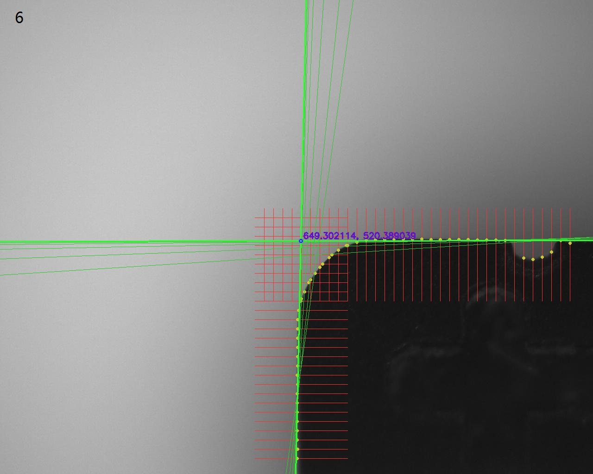

# 机器视觉-第八次作业

## 实现思路

- 观察目标图片们，为两个主要直线区域设置ROI。并观察主要直线，根据它们的倾角设置采样方向。
- 在每条采样线上间隔做差，以近似一阶导数，选其中大于阈值且最大的差值对应的点作为目标边缘像素。
- 对边缘像素进行最小二乘拟合，并根据拟合结果算出各点到直线的距离，利用这个距离来计算出$\varepsilon^2$、并计算点的权重。
- 根据权重，重新拟合，并计算出$\varepsilon^2$、更新权重，若此次计算出的$\varepsilon^2$与上一次$\varepsilon^2$的差值过大，可以认为没有收敛，重复该步。
- 对两条直线拟合完后，计算它们的交点，并绘制出来，输出图片结果。对每个图片，重复。

## 代码

```cpp
#include <vector>
#include <string>
#include "opencv2/opencv.hpp"

using namespace std;
using namespace cv;

#define DIR_HOR 1
#define DIR_VER 2
#define DIV_THRES 15

void findEdgePixel(Mat& img, vector<Point>& points, Mat& canvasimg, Rect& roi, int sampleinterval, int direction);
void fitLineMinSqr(vector<Point>& points, Point3d& linearg, Mat& canvasimg, int weight_thres);
void drawMyLine(Point3d& linearg, Mat& canvasimg, Scalar color, int thick);
void drawCrossPoint(Point3d& line1, Point3d& line2, Mat& canvasimg);

int main(){
    for (int i=5; i<=19; ++i){
        char filename[8];
        sprintf(filename, "%02d.jpg", i);
        Mat img = imread(string("../image/")+filename);
        Mat gray;
        Rect roi1(550, 450, 700, 200), roi2(550, 450, 200, 550);
        vector<Point> points1, points2;
        Point3d line1, line2;

        cvtColor(img, gray, COLOR_BGR2GRAY);

        findEdgePixel(gray, points1, img, roi1, 20, DIR_VER);
        findEdgePixel(gray, points2, img, roi2, 20, DIR_HOR);

        fitLineMinSqr(points1, line1, img, 40);
        fitLineMinSqr(points2, line2, img, 25);

        drawCrossPoint(line1, line2, img);

        imwrite(string("../outimg/out")+filename, img);
    }

    return 0;
}

void findEdgePixel(Mat& img, vector<Point>& points, Mat& canvasimg, Rect& roi, int sampleinterval, int direction){
    if (direction == DIR_HOR){
        /** 请自行补充 **/
    }
    else if (direction == DIR_VER){
        /** 请自行补充 **/
    }
}

void fitLineMinSqr(vector<Point>& points, Point3d& linearg, Mat& canvasimg, int weight_thres){
   /** 请自行补充 **/
}

void drawMyLine(Point3d& linearg, Mat& canvasimg, Scalar color, int thick){
    /** 请自行补充 **/
}

void drawCrossPoint(Point3d& line1, Point3d& line2, Mat& canvasimg){
    /** 请自行补充 **/
}

```

## 结果图





（可以减小阈值，以增加迭代次数，使结果更好一些。但已经可以明显看出较好的拟合效果了。）