# 基于 23 春回忆版试题的复习笔记

Author: Kowyo（黄梓峰）

Created Date: May 9th

Exam Date: May 11th

感谢20级学长练嘉顺整理的回忆版，自救群群友和香菇侠的解答，他们为这份笔记的整理的提供了巨大帮助。如无特殊说明，内容均来自2024年春季学期老师上课发的 [课件](https://open.osa.moe/openauto/AUTO3006/slides/)。就笔者刚刚考完的经验来说，这份笔记还有相当一部分空白，复习的时候还要多看课件。

## Content（目录）

[TOC]

## Lec 1: Introduction

### What is Machine Vision?

The automatic extraction of infomation from digital images.（机器视觉的定义）

数字图像中信息的自动提取。

#### What can Machine Vision do?

- Increase profits（增加利润）
- Reduce defects（减少缺陷）
- Increase yield（增加产量）
- Track , Trace and Control（跟踪、追踪和控制）
- Measurement, Counting, Location, Decoding and Inspection（测量、计数、定位、解码和检验）

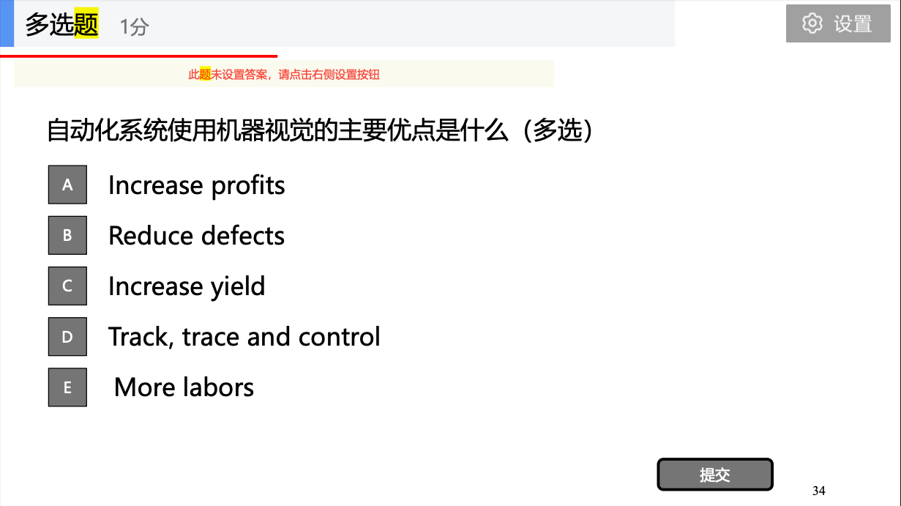

答案：ABCD

### Key Parts of a Machine Vision System

- Lighting（光源）
- Lens（镜头）
- Sensor（传感器）
- Vision Processing (Algorithm and software)（软件）
- Communication（通信）

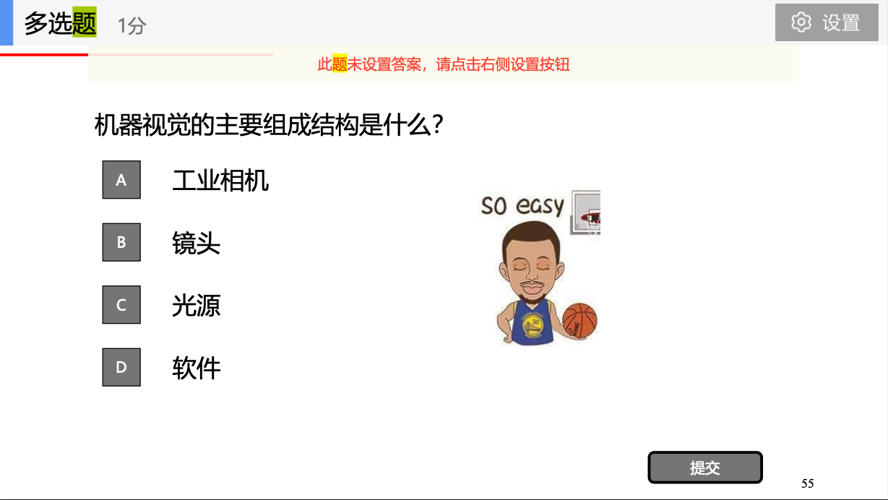

答案：BCD

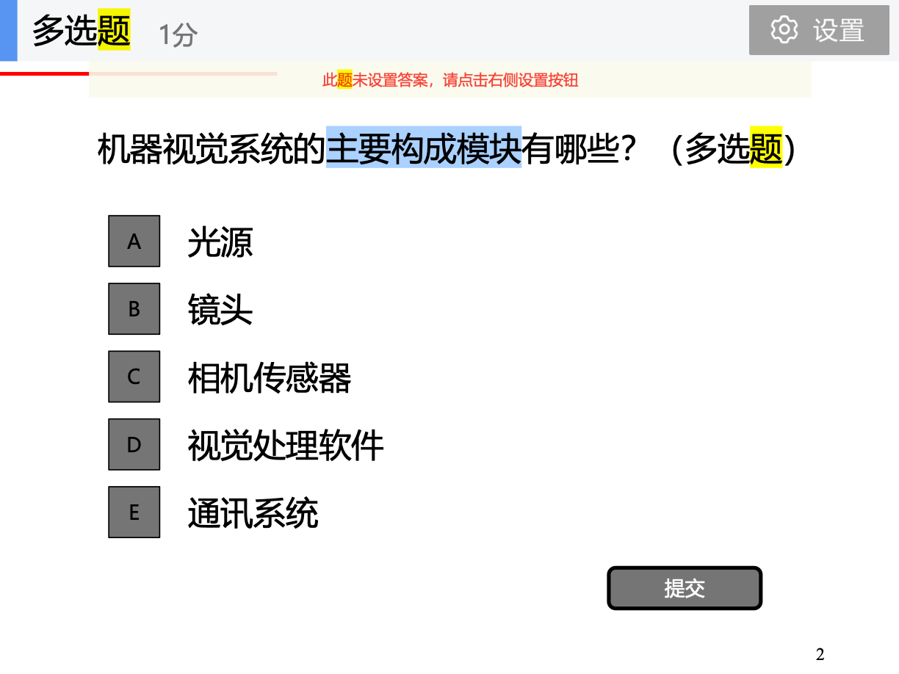

答案：ABCDE

### 传统的机器视觉 vs 基于深度学习的机器视觉

当将深度学习与传统机器视觉方法进行比较时，最大的区别在于特征提取的方式。

使用传统方法，视觉工程师必须决定寻找哪些特征来检测图像中的某个物体，他还必须为每个类选择正确的特征集。当可能的分类数量增加时，这很快就会变得繁琐。你在找颜色信息吗？边缘？纹理？根据使用的功能数量，许多参数也必须由工程师手动微调。

相比之下，深度学习使用“端到端学习”的概念。在这里，算法只是被告知要学习每个特定类的查找内容。通过分析示例图像，它会自动为每个类/对象找出最突出和描述性的特征。

| 应用领域 | 深度学习     | 传统方法           |
| -------- | ------------ | ------------------ |
| 应用特点 | 物体变异性高 | 刚性物体           |
|          | 物体方向可变 | 物体位置和方向固定 |
|          | 特征不明确   | 具有特定特征       |
|          | “无定形”物体 | 最大透明度要求     |
|          | 未知缺陷     | -                  |
|          | 图像数据充足 | -                  |

参考自 [MvTec](https://www.mvtec.com/technologies/deep-learning/classic-machine-vision-vs-deep-learning)

## Lec 2: How to design a MV system

### Specification of the task

产品或零件的两种运动方式

- **Indexed positioning**（索引定位）
-  **Continuous movement**（连续运动）

## Lec 3: Camera sensors

### Light and CCD/CMOS sensor

Quantum Efficiency: the ratio of light that the sensor converts into charge（量子效率的定义：传感器将光转换为电荷的比率）

### Camera Interfaces（相机接口）

- GigE Vision 标准（千兆以太网）
- IEEE 1394（视觉标准：DCAM）
- Camera Link
- USB

## Lec 4: Basic Optics and Lens

### Lens Mount（镜头装载标准）

回忆版中有一题问的是“工业镜头的两种接口”，经过群友讨论和[搜索引擎](https://www.edmundoptics.com/knowledge-center/application-notes/imaging/lens-mounts/#:~:text=The%20C%2DMount%20flange%20distance,flange%20distance%20of%2012.526mm.)给出如下答案：

- C
- CS
- F
- ...

只答前两个即可。

### Image Quality

影响图像质量的五个因素：

- Depth of field（景深）
- Resolution（分辨率）
- Contrast（对比度）
- Perspective（透视）
- Distortion（畸变）

### MTF

定义：

> MTF曲线图显示的是镜头对对比度的还原情况，纵轴表示对比度的优劣，横轴表示与成像中心的距离。虚、实两条曲线越接近，说明镜头越能够在如实表现被摄体的同时，更易拍出美丽虚化。——[佳能](https://www.canon.com.cn/product/ef/index/lensmtf.html)

MTF曲线生成过程：

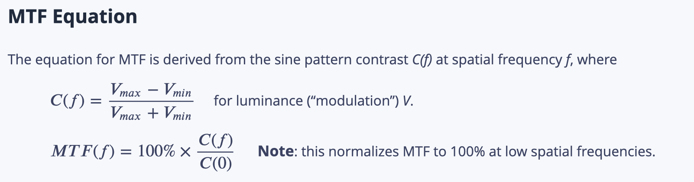

其中，V 是亮度，f 是频率（或前述的“与成像中心的距离”）。（参考自 Lec04 Page 26 和 [知乎](https://zhuanlan.zhihu.com/p/691522263)）

### Len Curves

Lens Distortion Curve（镜头畸变曲线）：Distortion describes is how “bent” a straight line would look when imaged through a lens with distortion.

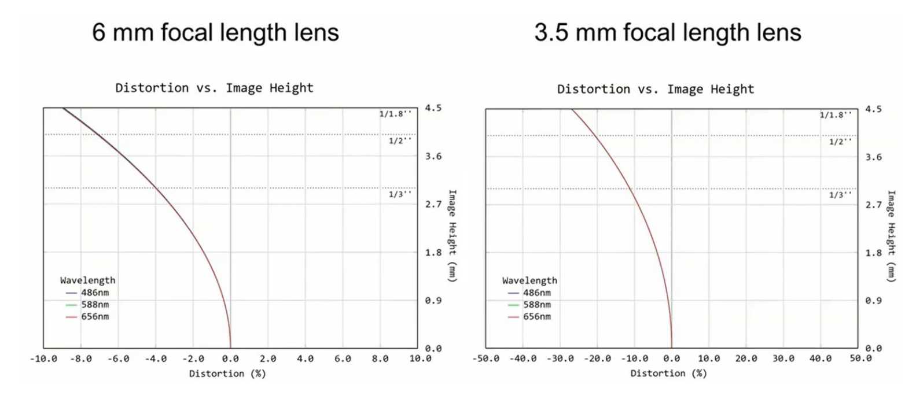

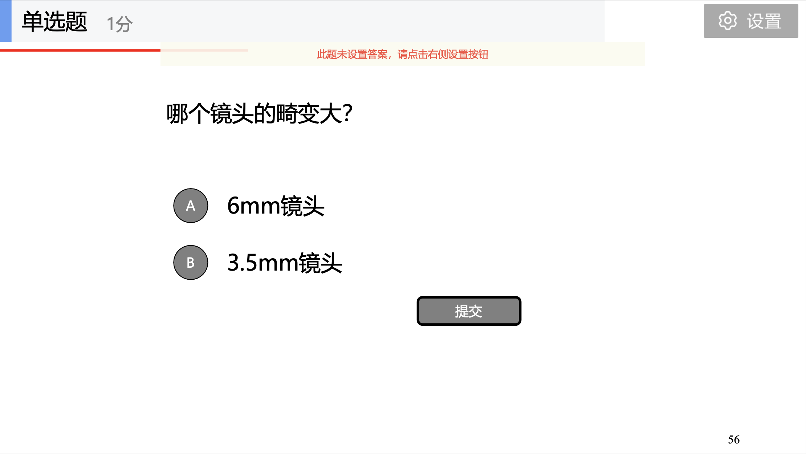

答案：A

### 焦距和分辨率

$$
1/f=1/u+1/v
$$

f 是焦距

| **名称** | **符号** | **单位** |
| -------- | ------------- | ------------- |
| 空间分辨率 | Rs | mm/pixel |
| 相机分辨率 | Rc | pixel |
| 待检测特征实际尺寸 | Sf | mm |
| 待检测特征对应最小像素 | Nf | pixel |

关系：
$$
R_c = \frac{FOV}{R_s}=FOV\frac{N_f}{S_f}
$$
其中，**FOV** 由实际物体确定，**Nf** 一般取1，**Sf** 由要求精度决定

## Lec 5: Lighting（光源）

### Solid Angle（立体角）

立体角 $d\Omega$ 计算公式：
$$
d\Omega = \frac{dAcos\theta}{r^2}
$$
其中 dA 是面积元，如下图所示：

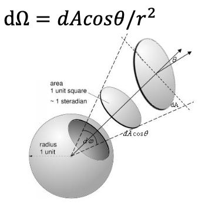

### Basic Lighting Techniques（打光方式）

- Bright Field (亮场照明) : greater than 45°

- Dark Field Lighting (暗场照明）: less than 45°

  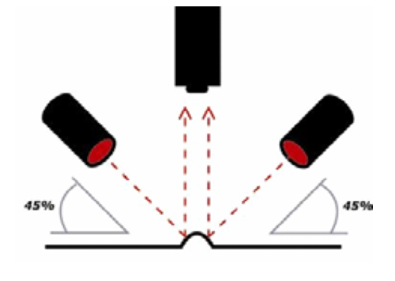

  暗场照明的特点和光路图？

  答：对表面凹凸表现力强。适用于晶片或玻璃基片上的伤痕检查。光路图如上图所示。

- Vertical Lighting（垂直照明）

- Back Lighting（背光照明）

- Multi-angle Lighting（多角度照明）

- Diffuse Dome（积分球照明）

- On-axis Diffuse（同轴照明）

- Flat Diffuse（平面漫射照明）

- Point Source（点光源照明）

- Strobe（频闪）

注：考试可能会让你写出其中4种[^1]。

### Principle of light Source Selection

红光和蓝光哪个更适合做背光光源?

答：背光源一般在检测轮廓时，可以尽量使用波长短的光源，波长短的光源其衍射性弱，图像边缘不容易产生重影，对比度更高。因此，应该选择波长更短的蓝光。（参考自 Lec06 的 Page 49）

### Example and Applications

酒瓶盖字符检测（检测金属瓶上红色字符，选用光源类型，颜色，打光方式）

光源：瓶盖为金属材料，表面有印刷图案，比较光滑，反光度很强，选用同轴光或带角度的环形光比较合适

颜色：选用红色。PPT 上选用蓝色，是为了不让红色背景打白，但是现在是红色字符。可以参考这个[网页](https://www.photon-tech.com.tw/zh/support/show/10165)。

打光方式：根据距离确定，如果瓶盖离纸箱上顶部的距离有80mm，考虑需要留一定的空间，因此，瓶盖离光源需要的距离为 100 mm 或以上，如此高的距离，小同轴光跟小环光以及低角度光就不能满足要求，必须选用大同轴光跟大环光。

## Lec 7: Algorithm Fundamentals

使用深度优先搜索，图上标出连通域。做题方法参考下图：

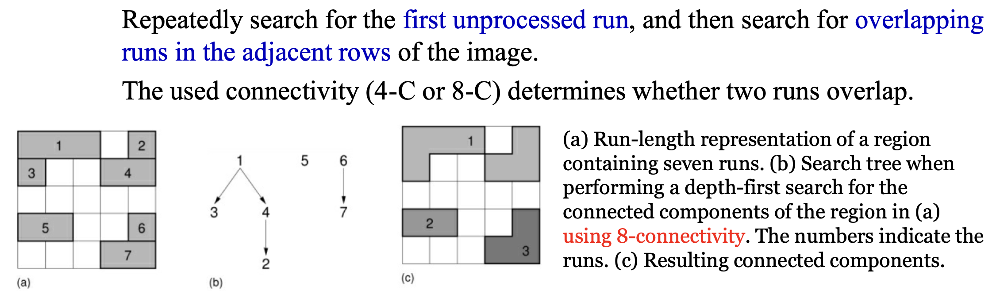

## Lec 8: Algorithm Fundamentals II

简述 Blob 分析的原理，适用的图像：

原理：

Blob 是指从图像中获取的二值区域，Blob 分析是指对该二值区域，进行面积、周长重心等特征的分析。

适用的图像：

- 二维目标图像
- 高对比度图像
- 场景简单图像

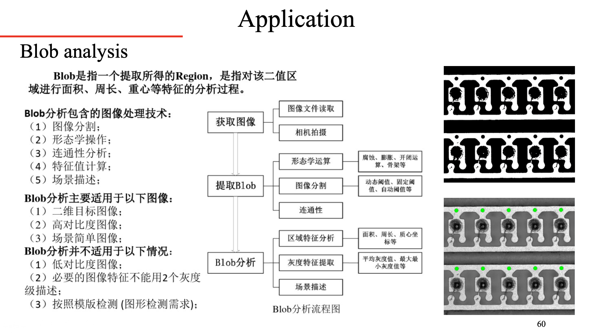

## Lec 9: Grayscale Template Matching

### Normalized Cross-Correlation (NCC)

NCC的原理，加速方式，优缺点?

原理：

> 归一化互相关算法(NCC)是一种常用的图像特征点匹配算法，其原理是根据两幅图像中特征点邻域像素灰度值的相似性来匹配的，对于左图像中的一点，计算其与右图像中所有特征点的归一化互相关系数，当得到其中最大值的点就为最佳匹配位置。——[《哈尔滨工程大学学报》](http://html.rhhz.net/HEBGCDXXB/html/201512022.htm)

加速方式：Lec 10 部分提到的方法。Lec 9 里面重点讲了图像金字塔的方法。

## Lec 10: Robust Template Matching

基于形状的模板匹配的3种加速计算方式：

- Early termination
- Using image pyramid
- Using image ROI
- Using offline template training
- Edge Point Reduction

### R-table

步骤如下：

1. At each boundary point, compute the edge,location vector: 𝑟 = 𝑜 − 𝑒 and 𝜃

2. Store these vectors in a table indexed by gradient orientation (edge location) 𝜙

说人话就是：

> 图形里选一个参考点，把边缘点和参考点连起来形成一个向量得到长度r和角度θ，梯度方向是φ，然后把所有边缘点的数对（r，θ）建立成以φ为索引的表 —— 自救群群友，21 自动化 R.G

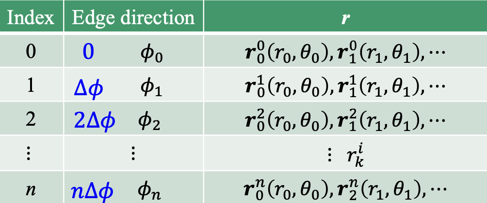

## Lec 11: Edge Detection and 1D 2D measurement

拟合边缘直线: Page 58

------

[^1]: [2023年回忆版](https://hoa.moe/docs/junior-spring/auto3006/#资料下载)

